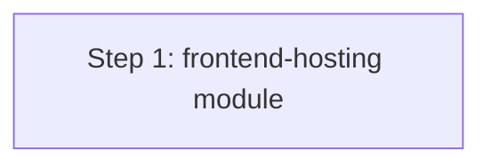

# Terraform Plan: docs-portal — dev

> **Status:** Approved  
> **Spec:** [infrastructure-spec.yaml](../../specs/docs-portal/dev/infrastructure-spec.yaml)  
> **Architecture:** [architecture.md](../../specs/docs-portal/dev/architecture.md)  
> **Date:** 2026-08-04

---

## ⚠️ Decisions Required Before Build

| # | Decision | Blocks | Owner |
|---|----------|--------|-------|
| — | None — all decisions resolved | — | — |

---

## Overview

This builds the static hosting infrastructure for the `docs-portal` in the `dev` environment. It creates a new `frontend-hosting` module that provisions a strictly private S3 bucket, CloudFront distribution with Origin Access Control (OAC), an ACM TLS certificate, and Route53 DNS records for the `kiranbakale.online` domain.

---

## Module List

| Module | Path | Status | Purpose |
|--------|------|--------|---------|
| frontend-hosting | `terraform/modules/frontend-hosting` | New | Provisions S3, CloudFront with OAC, ACM, and Route53. |

---

## Resource Inventory

### Frontend Hosting

| Resource Type | Name Pattern | Count | Notes |
|--------------|-------------|-------|-------|
| `aws_s3_bucket` | `${project}-${env}-assets` | 1 | Strictly private bucket for index.html |
| `aws_s3_bucket` | `${project}-${env}-logs` | 1 | CloudFront access logs |
| `aws_cloudfront_origin_access_control` | `${project}-${env}-oac` | 1 | Restricts S3 access to CF |
| `aws_cloudfront_distribution` | `${project}-${env}-cdn` | 1 | Caches and serves content over HTTPS |
| `aws_acm_certificate` | `${domain_name}` | 1 | Created in `us-east-1` for CF |
| `aws_acm_certificate_validation` | `${domain_name}-validation` | 1 | Wait for DNS validation |
| `aws_route53_record` | `${domain_name}` | 1 (Alias) | Points domain to CF |
| `aws_route53_record` | `${domain_name}-cert` | 1 | Certificate validation record |
| `aws_s3_bucket_public_access_block` | `${project}-${env}-assets-pab` | 2 | For both assets and logs buckets |
| `aws_s3_bucket_policy` | `${project}-${env}-assets-policy` | 1 | Allows OAC read |

---

## Variable Contract

### Required Variables (no default)

| Variable | Type | Description |
|---------|------|-------------|
| `project` | `string` | Project name (e.g., docs-portal) |
| `environment` | `string` | Environment (e.g., dev) |
| `domain_name` | `string` | Target domain (`kiranbakale.online`) |
| `owner` | `string` | Team responsible (`devops team`) |
| `cost_center` | `string` | Billing cost center code |

---

## Output Contract

| Output | Type | Description |
|--------|------|-------------|
| `cloudfront_url` | `string` | HTTPS URL of the CloudFront distribution |
| `s3_assets_bucket` | `string` | Name of the S3 bucket for assets |

---

## Backend Configuration Design

### Backend Type
`local` (Since standard remote backend has not been configured yet, we will use local backend for dev, or S3 if standard). For now, `backend.tf` will use local.

---

## Implementation Order

**Build sequence:**

| Step | Task | Depends On | Verification |
|------|------|-----------|-------------|
| 1 | Create `modules/frontend-hosting` | None | `terraform validate` on module |
| 2 | Create service root `docs-portal/dev` | All modules | Full `terraform plan` |

---

## Risks and Mitigations

| Risk | Likelihood | Impact | Mitigation |
|------|-----------|--------|------------|
| ACM Validation Timeout | Medium | High | Ensure correct Route53 Zone ID is referenced. |

---

## Open Items

- [ ] None.
