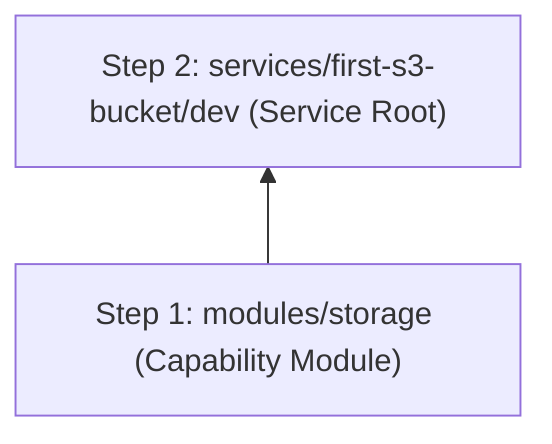

# Terraform Plan: first-s3-bucket — dev

> **Status:** Approved  
> **Spec:** [infrastructure-spec.yaml](../../specs/first-s3-bucket/dev/infrastructure-spec.yaml)  
> **Architecture:** [architecture.md](../../specs/first-s3-bucket/dev/architecture.md)  
> **Date:** 2026-08-06

---

## ⚠️ Decisions Required Before Build

| # | Decision | Blocks | Owner |
|---|----------|--------|-------|
| — | None — all decisions resolved | — | — |

---

## Overview

This plan details the technical implementation for creating a production-grade, secure AWS S3 Object Storage bucket (`first-s3-bucket`) in the `dev` environment (`ap-south-1`). It provisions a reusable `storage` module in `terraform/modules/storage` and instantiates it within `terraform/services/first-s3-bucket/dev/`.

---

## Module List

| Module | Path | Status | Purpose |
| :--- | :--- | :--- | :--- |
| storage | `terraform/modules/storage` | New | Reusable capability module for S3 bucket with security defaults, versioning, encryption, and lifecycle policies |

---

## Resource Inventory

### Storage (`terraform/modules/storage`)

| Resource Type | Name Pattern | Count | Notes |
| :--- | :--- | :--- | :--- |
| `aws_s3_bucket` | `${project_prefix}-${bucket_name_suffix}-${account_id}` | 1 | Primary S3 storage bucket |
| `aws_s3_bucket_public_access_block` | `${project_prefix}-${bucket_name_suffix}-pab` | 1 | Block all public ACLs & policies (default-deny) |
| `aws_s3_bucket_server_side_encryption_configuration` | `${project_prefix}-${bucket_name_suffix}-sse` | 1 | AES256 server-side encryption |
| `aws_s3_bucket_versioning` | `${project_prefix}-${bucket_name_suffix}-versioning` | 1 | Native bucket object versioning enabled |
| `aws_s3_bucket_lifecycle_configuration` | `${project_prefix}-${bucket_name_suffix}-lifecycle` | 1 | Transition non-current object versions to Standard-IA after 30 days |

---

## Variable Contract

### Required Variables (no default)

| Variable | Type | Description |
| :--- | :--- | :--- |
| `bucket_name_suffix` | `string` | Unique suffix for bucket naming (e.g. `first-storage`) |

### Optional Variables (with default)

| Variable | Type | Default | Description |
| :--- | :--- | :--- | :--- |
| `project_prefix` | `string` | `"terraform-sdd"` | Project identifier for naming and tagging |
| `environment` | `string` | `"dev"` | Target environment name |
| `aws_region` | `string` | `"ap-south-1"` | AWS deployment region |
| `owner` | `string` | `"DevOps"` | Team owner tag |
| `cost_center` | `string` | `"DevOps-101"` | Cost center billing code |
| `enable_versioning` | `bool` | `true` | Enable bucket object versioning |
| `noncurrent_version_transition_days` | `number` | `30` | Days before non-current versions transition to Standard-IA |

---

## Output Contract

| Output | Type | Description |
| :--- | :--- | :--- |
| `s3_bucket_id` | `string` | ID/Name of the created S3 bucket |
| `s3_bucket_arn` | `string` | Amazon Resource Name (ARN) of the bucket |
| `s3_bucket_domain_name` | `string` | FQDN domain name of the S3 bucket |

---

## Backend Configuration Design

### Backend Type
`s3` (AWS Native State Storage & Locking)

### State Key & Bucket Configuration
```ini
bucket       = "terraform-sdd-tfstate-682563173581"
key          = "services/first-s3-bucket/dev/terraform.tfstate"
region       = "ap-south-1"
encrypt      = true
use_lockfile = true
```

---

## Implementation Order



**Build sequence:**

| Step | Task | Depends On | Verification |
| :--- | :--- | :--- | :--- |
| 1 | Create `terraform/modules/storage/` (`main.tf`, `variables.tf`, `outputs.tf`, `README.md`) | None | `terraform fmt` + `terraform validate` |
| 2 | Create `terraform/services/first-s3-bucket/dev/` (`providers.tf`, `backend.tf`, `locals.tf`, `main.tf`, `variables.tf`, `outputs.tf`, `terraform.tfvars`) | `modules/storage` | `terraform fmt` + `terraform validate` |

---

## Risks and Mitigations

| Risk | Likelihood | Impact | Mitigation |
| :--- | :--- | :--- | :--- |
| Bucket name collision | Low | High | Include AWS Account ID dynamically in bucket name (`${project_prefix}-${bucket_name_suffix}-${account_id}`) |
| Accidental bucket deletion | Low | Critical | S3 Lifecycle `prevent_destroy = false` in dev, set to `true` in prod; versioning enabled |

---

## Verification Plan

### After Module Creation (`terraform/modules/storage`)
```bash
cd terraform/modules/storage
terraform init -backend=false
terraform validate
```

### After Service Root Assembly (`terraform/services/first-s3-bucket/dev`)
```bash
cd terraform/services/first-s3-bucket/dev
terraform init -backend=false
terraform fmt -check -recursive
terraform validate
```

---

## Checklist Before /build Completion

- [ ] Capability module `terraform/modules/storage` created
- [ ] Service root `terraform/services/first-s3-bucket/dev` created
- [ ] `terraform fmt -check` passes
- [ ] `terraform validate` passes
- [ ] All variables have `type` and `description`
- [ ] All outputs have `description`
