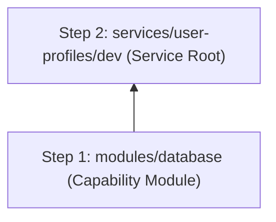

# Terraform Plan: user-profiles — dev

> **Status:** Approved  
> **Spec:** [infrastructure-spec.yaml](../../specs/user-profiles/dev/infrastructure-spec.yaml)  
> **Architecture:** [architecture.md](../../specs/user-profiles/dev/architecture.md)  
> **Date:** 2026-08-06

---

## ⚠️ Decisions Required Before Build

| # | Decision | Blocks | Owner |
|---|----------|--------|-------|
| — | None — all decisions resolved | — | — |

---

## Overview

This plan details the technical implementation for creating a production-grade AWS DynamoDB NoSQL database table (`user-profiles`) in the `dev` environment (`ap-south-1`). It provisions a reusable `database` capability module in `terraform/modules/database` and instantiates it within `terraform/services/user-profiles/dev/`.

---

## Module List

| Module | Path | Status | Purpose |
| :--- | :--- | :--- | :--- |
| database | `terraform/modules/database` | New | Reusable capability module for DynamoDB tables with On-Demand billing, GSI secondary indexing, Point-In-Time Recovery, and SSE encryption |

---

## Resource Inventory

### Database (`terraform/modules/database`)

| Resource Type | Name Pattern | Count | Notes |
| :--- | :--- | :--- | :--- |
| `aws_dynamodb_table` | `${project_prefix}-${service_name}-${environment}` | 1 | Primary DynamoDB NoSQL table with `user_id` partition key, `created_at` sort key, `email-index` GSI, KMS encryption, and PITR backup |

---

## Variable Contract

### Required Variables (no default)

| Variable | Type | Description |
| :--- | :--- | :--- |
| `service_name` | `string` | Service identifier (e.g. `user-profiles`) |

### Optional Variables (with default)

| Variable | Type | Default | Description |
| :--- | :--- | :--- | :--- |
| `project_prefix` | `string` | `"terraform-sdd"` | Project prefix for naming and tagging |
| `environment` | `string` | `"dev"` | Target environment name |
| `billing_mode` | `string` | `"PAY_PER_REQUEST"` | Billing mode (`PAY_PER_REQUEST` or `PROVISIONED`) |
| `enable_pitr` | `bool` | `true` | Enable Point-In-Time Recovery continuous backup |
| `enable_encryption` | `bool` | `true` | Enable Server-Side Encryption |
| `aws_region` | `string` | `"ap-south-1"` | AWS deployment region |
| `owner` | `string` | `"User Service Team"` | Team owner tag |
| `cost_center` | `string` | `"DevOps-102"` | Cost center billing code |

---

## Output Contract

| Output | Type | Description |
| :--- | :--- | :--- |
| `dynamodb_table_name` | `string` | Name of the created DynamoDB table |
| `dynamodb_table_arn` | `string` | Amazon Resource Name (ARN) of the DynamoDB table |
| `dynamodb_table_id` | `string` | Unique identifier of the DynamoDB table |

---

## Backend Configuration Design

### Backend Type
`s3` (AWS Native State Storage & Locking)

### State Key & Bucket Configuration
```ini
bucket       = "terraform-sdd-tfstate-682563173581"
key          = "services/user-profiles/dev/terraform.tfstate"
region       = "ap-south-1"
encrypt      = true
use_lockfile = true
```

---

## Implementation Order



**Build sequence:**

| Step | Task | Depends On | Verification |
| :--- | :--- | :--- | :--- |
| 1 | Create `terraform/modules/database/` (`main.tf`, `variables.tf`, `outputs.tf`, `README.md`) | None | `terraform fmt` + `terraform validate` |
| 2 | Create `terraform/services/user-profiles/dev/` (`providers.tf`, `backend.tf`, `locals.tf`, `main.tf`, `variables.tf`, `outputs.tf`, `terraform.tfvars`) | `modules/database` | `terraform fmt` + `terraform validate` |

---

## Risks and Mitigations

| Risk | Likelihood | Impact | Mitigation |
| :--- | :--- | :--- | :--- |
| Table deletion in dev | Low | High | Enable Point-In-Time Recovery (PITR); set `deletion_protection_enabled = true` in prod |
| Unbounded GSI projection cost | Low | Medium | Use `KEYS_ONLY` or `INCLUDE` projections on GSIs when full record projection is unneeded |

---

## Verification Plan

### After Module Creation (`terraform/modules/database`)
```bash
cd terraform/modules/database
terraform init -backend=false
terraform validate
```

### After Service Root Assembly (`terraform/services/user-profiles/dev`)
```bash
cd terraform/services/user-profiles/dev
terraform init -backend-config=../../../backends/dev.tfbackend
terraform fmt -check -recursive
terraform validate
```

---

## Checklist Before /build Completion

- [ ] Capability module `terraform/modules/database` created
- [ ] Service root `terraform/services/user-profiles/dev` created
- [ ] `terraform fmt -check` passes
- [ ] `terraform validate` passes
- [ ] All variables have `type` and `description`
- [ ] All outputs have `description`
