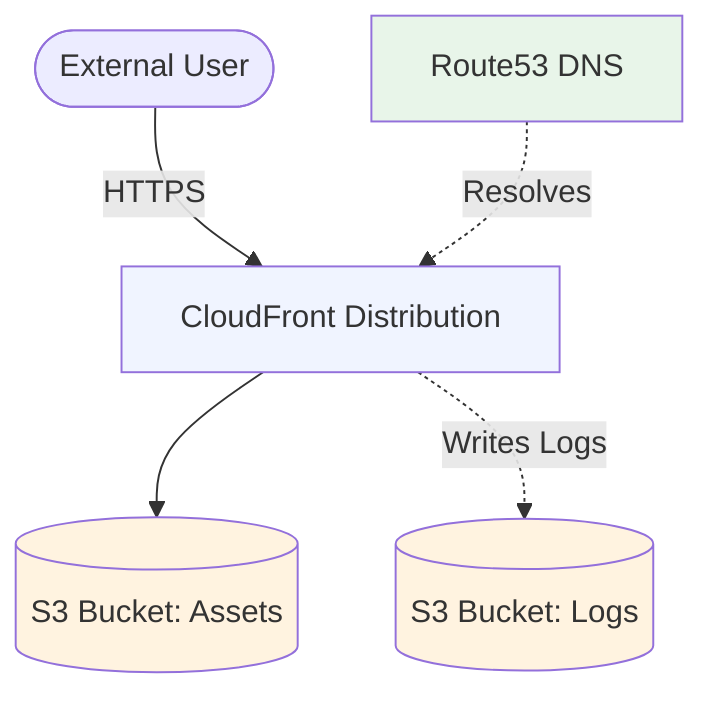
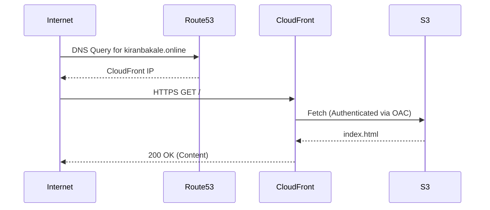
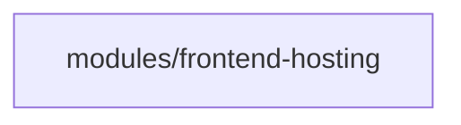

# Architecture: docs-portal — dev

> **Status:** Approved  
> **Spec:** [infrastructure-spec.yaml](./infrastructure-spec.yaml)  
> **ADRs:** [decisions/](./decisions/)  
> **Last updated:** 2026-08-04

---

## 1. Purpose and Scope

### What

This infrastructure supports the hosting of the documentation portal. It provides a simple static website (a sample "hello world" single page) served securely over HTTPS via a Content Delivery Network. 

### Who

| Consumer | Need |
|---------|------|
| Users | Access to documentation over a secure, fast CDN |
| DevOps Team | Low cost, maintenance-free static hosting |

### In Scope

- S3 Bucket for static assets (Strictly Private)
- S3 Bucket for CloudFront access logs
- CloudFront Distribution configured with Origin Access Control (OAC)
- ACM TLS Certificate provisioning (DNS validated)
- Route53 DNS records for `kiranbakale.online` targeting CloudFront

### Out of Scope

- CI/CD pipeline for deploying the HTML contents to S3 (handled externally)
- Registration of the domain `kiranbakale.online` (already registered and managed in Route53)

---

## 2. System Context

---

## 3. Service Boundaries

### Owned by This Root

| Resource | Description |
|---------|-------------|
| `aws_s3_bucket` (Assets) | Stores the `index.html` static site content |
| `aws_s3_bucket` (Logs) | Stores CloudFront access logs |
| `aws_cloudfront_distribution` | CDN for caching and serving the content globally |
| `aws_cloudfront_origin_access_control` | Restricts S3 access exclusively to CloudFront |
| `aws_acm_certificate` | TLS certificate for `kiranbakale.online` (us-east-1) |
| `aws_route53_record` | A-Record Alias to CloudFront & CNAME for ACM validation |

### Dependencies (Inputs)

| Input | Source | How Provided |
|-------|--------|-------------|
| `domain_name` | User configuration | `terraform.tfvars` (`kiranbakale.online`) |
| `route53_zone_id` | Existing AWS Environment | Data Source (query by domain) |

### Exported (Outputs)

| Output | Consumed By | Purpose |
|--------|------------|---------|
| `cloudfront_url` | Users / CI/CD | Endpoint reference |
| `s3_bucket_name` | CI/CD | Target for uploading new static content |

---

## 4. Networking Design

### Traffic Flow

---

## 5. Compute Design

### Service Selection

**Static Hosting (No Compute):**
Compute services like EC2, ECS, or Lambda are explicitly avoided to keep costs low. We rely solely on the managed object storage (S3) and CDN (CloudFront) services.

---

## 6. Data Design

### Data Stores

| Store | Type | Engine | Description | Public Access |
|-------|------|--------|-------------|---------------|
| `assets` | Object | S3 | Holds `index.html` | Blocked (OAC only) |
| `logs` | Object | S3 | CloudFront access logs | Blocked |

---

## 7. Security Model

### Identity & Access

| Actor | Identity Mechanism | Permissions Scope |
|-------|------------------|------------------|
| CloudFront | Origin Access Control (OAC) | `s3:GetObject` on the Assets Bucket |
| CI/CD System | IAM Role (Out of Scope) | `s3:PutObject` on the Assets Bucket |

### Encryption

| Data | At Rest | In Transit |
|------|---------|-----------|
| S3 Objects | SSE-S3 (AES-256) | TLS 1.2+ |
| End-User Traffic | N/A | TLS 1.2+ (Enforced by CloudFront) |

---

## 8. Observability

### Logging

CloudFront standard logging is enabled and configured to deliver access logs to the dedicated `logs` S3 bucket.

---

## 9. Disaster Recovery

| Property | Value |
|---------|-------|
| Backup frequency | N/A (Static files source controlled) |
| Cross-region backup | No |

### Recovery Procedure

Since the infrastructure holds only static content, disaster recovery involves re-applying the Terraform state and triggering a CI/CD pipeline run to re-upload the `index.html` file to S3.

---

## 10. Module Dependency Graph

**Implementation details**:
We will implement a reusable `frontend-hosting` module that takes domain configurations and handles S3, CloudFront, ACM, and Route53 integration internally.

---

## 11. Feature Traceability

| Spec Requirement | Terraform Resource | Module |
|-----------------|-------------------|--------|
| Custom Domain & DNS | `aws_route53_record` | frontend-hosting |
| HTTPS Enforcement | `aws_acm_certificate`, `aws_cloudfront_distribution` | frontend-hosting |
| Strictly Private S3 | `aws_s3_bucket_public_access_block`, `aws_s3_bucket_policy` | frontend-hosting |
| OAC Integration | `aws_cloudfront_origin_access_control` | frontend-hosting |
| Access Logging | `aws_s3_bucket`, `aws_cloudfront_distribution` | frontend-hosting |

---

## Architecture Decisions

| # | Decision | Status | ADR |
|---|----------|--------|-----|
| D1 | Use S3 + CloudFront with OAC for static hosting | Accepted | [ADR-001](./decisions/ADR-001-frontend-hosting.md) |
