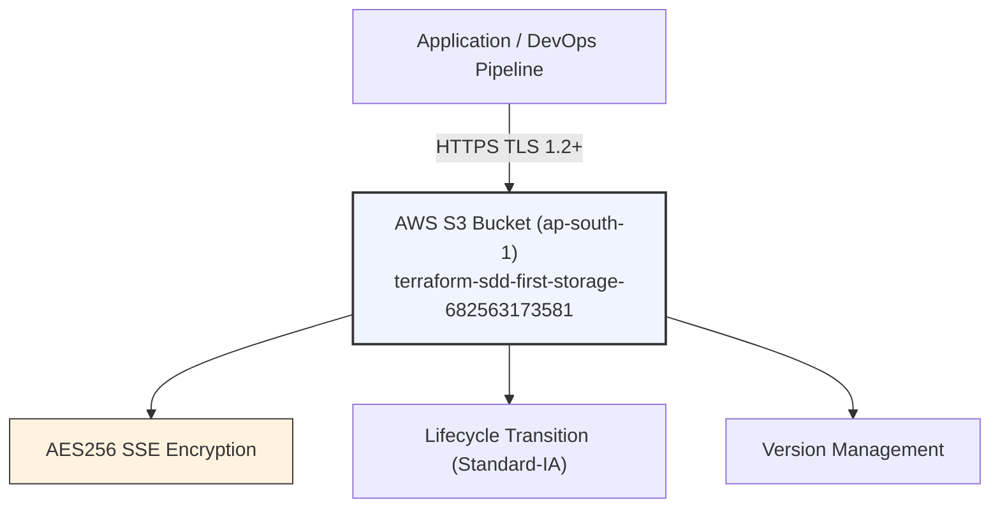
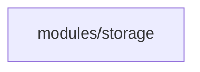

# Architecture: First S3 Bucket — dev

> **Status:** Approved  
> **Spec:** [infrastructure-spec.yaml](./infrastructure-spec.yaml)  
> **ADRs:** [decisions/](./decisions/)  
> **Last updated:** 2026-08-06

---

## 1. Purpose and Scope

### What
This infrastructure provisions a secure, production-ready AWS S3 object storage bucket with a unique suffix (`terraform-sdd-first-something-<account_id>`) for application asset storage and backup management.

### Consumers

| Consumer | Need |
| :--- | :--- |
| DevOps & Application Services | Production-grade, encrypted object storage for assets and files |

### In Scope
- S3 Bucket creation with unique suffix
- Block Public Access configuration (default-deny)
- Server-side encryption configuration (AES256)
- Versioning status configuration
- S3 Bucket Lifecycle configuration (Standard-IA transition)
- Standard resource tagging

### Out of Scope
- Public web hosting / CloudFront distribution (can be added in future spec iterations)
- Application-level access IAM users (uses IAM Roles / OIDC)

---

## 2. System Context

---

## 3. Service Boundaries

### Owned by This Root

| Resource | Description |
| :--- | :--- |
| `aws_s3_bucket.main` | Core S3 Bucket instance |
| `aws_s3_bucket_public_access_block.main` | Public access prevention policy |
| `aws_s3_bucket_server_side_encryption_configuration.main` | Default AES256 server-side encryption |
| `aws_s3_bucket_versioning.main` | Native bucket versioning |
| `aws_s3_bucket_lifecycle_configuration.main` | Object lifecycle transition policy |

---

## 4. Security Model

| Data | At Rest | In Transit | Public Access |
| :--- | :--- | :--- | :--- |
| Object Storage | SSE-S3 (AES256) | TLS 1.2+ mandatory | Blocked (100% Private) |

---

## 5. Module Dependency Graph

---

## 6. Architecture Decisions

| # | Decision | Status | ADR |
| :--- | :--- | :--- | :--- |
| D1 | S3 Bucket Security, Versioning, and Lifecycle Standard | Accepted | [ADR-001](./decisions/ADR-001-s3-bucket-security-and-lifecycle.md) |
