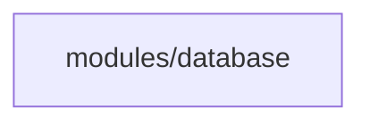

# Architecture: User Profiles DynamoDB Table — dev

> **Status:** Approved  
> **Spec:** [infrastructure-spec.yaml](./infrastructure-spec.yaml)  
> **ADRs:** [decisions/](./decisions/)  
> **Last updated:** 2026-08-06

---

## 1. Purpose and Scope

### What
This infrastructure provisions a high-performance, serverless AWS DynamoDB NoSQL database table (`terraform-sdd-user-profiles-dev`) for user profile data, preferences, and session metadata.

### Consumers

| Consumer | Need |
| :--- | :--- |
| User Microservices & Auth Services | Sub-10ms single-digit millisecond latency access to user profile records |

### In Scope
- DynamoDB Table creation (`terraform-sdd-user-profiles-dev`)
- Primary Key schema: Partition key `user_id` (String), Sort key `created_at` (String)
- Global Secondary Index (GSI): `email-index` with partition key `email` (String) for lookup by email
- On-Demand Billing (`PAY_PER_REQUEST`)
- Default AWS Managed Server-Side Encryption (KMS)
- Point-In-Time Recovery (PITR) continuous backup
- Mandatory resource tagging

### Out of Scope
- Application IAM roles / Lambda triggers (handled by compute services)
- Multi-Region Global Tables (can be added in future spec iterations if cross-region active-active is required)

---

## 2. System Context

```mermaid
graph TB
    App["Application / API Microservices"] -->|HTTPS AWS SDK (ap-south-1)| DDB["AWS DynamoDB Table<br/>terraform-sdd-user-profiles-dev"]
    DDB --> KMS["AWS KMS Server-Side Encryption"]
    DDB --> PITR["Point-In-Time Recovery (35 Days)"]
    DDB --> GSI["Global Secondary Index: email-index"]

    style DDB fill:#f0f4ff,stroke:#333,stroke-width:2px
    style KMS fill:#fff3e0,stroke:#333,stroke-width:1px
    style PITR fill:#e8f5e9,stroke:#333,stroke-width:1px
```

---

## 3. Service Boundaries

### Owned by This Root

| Resource | Description |
| :--- | :--- |
| `aws_dynamodb_table.main` | Core DynamoDB Table with Partition key `user_id`, Sort key `created_at`, GSI `email-index`, PITR, and SSE |

---

## 4. Security Model

| Data | At Rest | In Transit | Access Control |
| :--- | :--- | :--- | :--- |
| NoSQL Documents | AWS KMS Server-Side Encryption | TLS 1.2+ mandatory | IAM Least Privilege (SigV4) |

---

## 5. Module Dependency Graph



---

## 6. Architecture Decisions

| # | Decision | Status | ADR |
| :--- | :--- | :--- | :--- |
| D1 | DynamoDB Billing Mode, Security, and Backup Strategy | Accepted | [ADR-001](./decisions/ADR-001-dynamodb-billing-and-security.md) |
