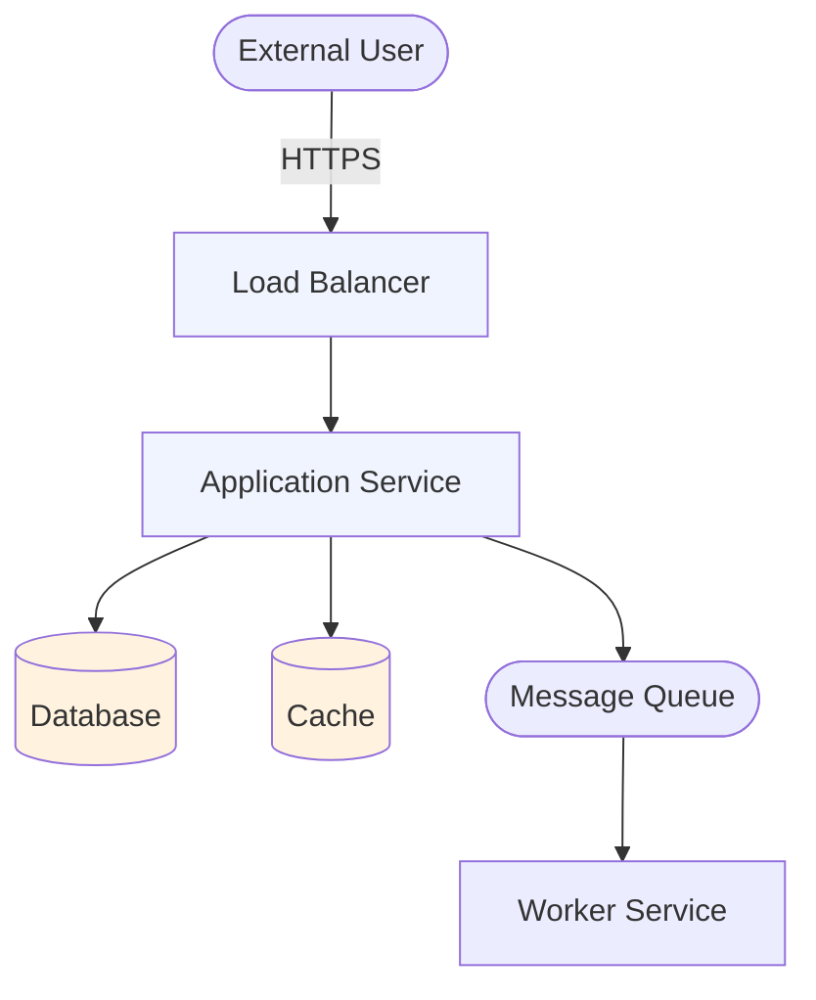
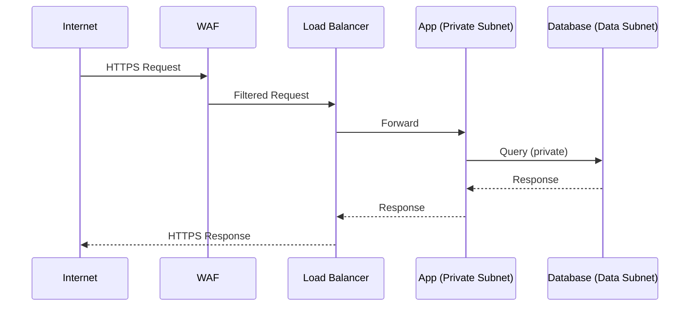
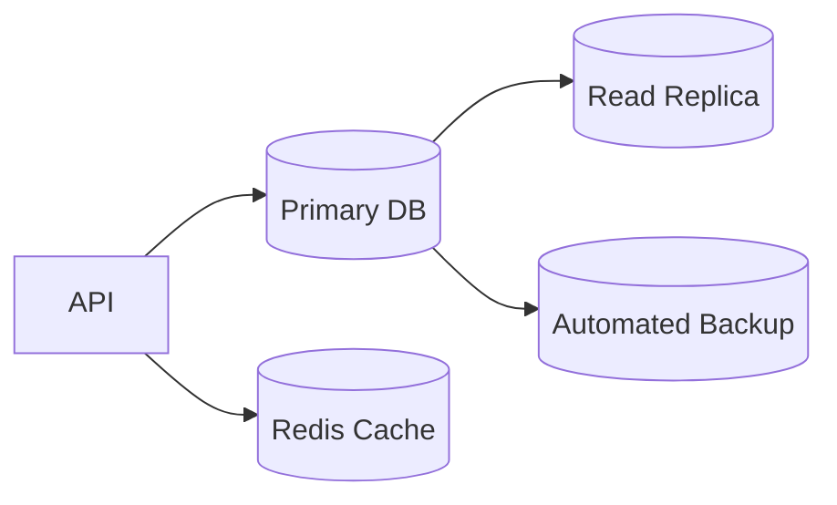
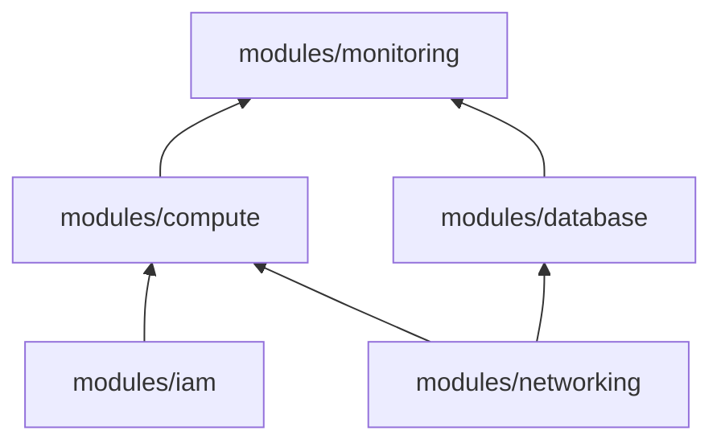
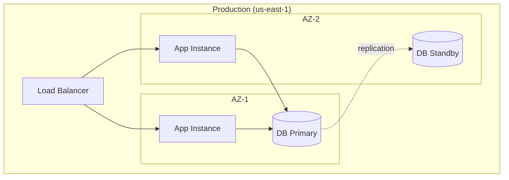

# Architecture: [Service Name] — [Environment]

<!--
Usage: Copy this file to specs/<service>/<env>/architecture.md
This is the locked system design document. Update it when architecture changes,
but treat it as a contract — reopen sections consciously, not casually.
-->

> **Status:** Draft | Approved | Superseded  
> **Spec:** [infrastructure-spec.yaml](./infrastructure-spec.yaml)  
> **ADRs:** [decisions/](./decisions/)  
> **Last updated:** YYYY-MM-DD

---

## ⚠️ Open Decisions (Blocking)

<!--
List any decisions that are not yet resolved and block implementation.
Clear this table before approving this document.
-->

| # | Decision | Blocks | Owner | Due |
|---|----------|--------|-------|-----|
| D1 | [Decision needed] | [What it blocks] | [Owner] | YYYY-MM-DD |

---

## Table of Contents

1. [Purpose and Scope](#1-purpose-and-scope)
2. [System Context](#2-system-context)
3. [Service Boundaries](#3-service-boundaries)
4. [Networking Design](#4-networking-design)
5. [Compute Design](#5-compute-design)
6. [Data Design](#6-data-design)
7. [Security Model](#7-security-model)
8. [Observability](#8-observability)
9. [Disaster Recovery](#9-disaster-recovery)
10. [Module Dependency Graph](#10-module-dependency-graph)
11. [Deployment Topology](#11-deployment-topology)
12. [Feature Traceability](#12-feature-traceability)

---

## 1. Purpose and Scope

### What

[One paragraph describing what this infrastructure supports. What workload does it serve?]

### Who

| Consumer | Need |
|---------|------|
| [Service / team] | [What they need from this infrastructure] |

### In Scope

- [What is provisioned by this Terraform]
- [...]

### Out of Scope

- [What is NOT provisioned here — managed elsewhere or by another service]
- [...]

---

## 2. System Context

<!--
High-level view of how this service connects to the world.
Show: external consumers, other internal services, cloud services.
-->



---

## 3. Service Boundaries

<!--
What does THIS Terraform root own vs what is owned by other roots or shared?
Be explicit about handoff points (VPC IDs passed as variables, shared subnets, etc.)
-->

### Owned by This Root

| Resource | Description |
|---------|-------------|
| [resource] | [what it is] |

### Dependencies (Inputs)

| Input | Source | How Provided |
|-------|--------|-------------|
| `vpc_id` | Shared networking root | Variable / data source |
| [input] | [source] | [how] |

### Exported (Outputs)

| Output | Consumed By | Purpose |
|--------|------------|---------|
| `service_url` | [consumer] | [purpose] |
| [output] | [consumer] | [purpose] |

---

## 4. Networking Design

### VPC / Virtual Network

| Property | Value |
|---------|-------|
| CIDR | |
| Availability Zones | |
| Public Subnets | |
| Private Subnets | |
| Data Subnets | |
| Internet Gateway | |
| NAT Gateway | |

### Subnet Layout

```
VPC: 10.x.0.0/16
├── Public Subnets (10.x.1.0/24, 10.x.2.0/24)
│   └── Load balancer, NAT gateway
├── Private Subnets (10.x.10.0/24, 10.x.11.0/24)
│   └── Application compute
└── Data Subnets (10.x.20.0/24, 10.x.21.0/24)
    └── Databases, caches
```

### Traffic Flow



### Security Groups / NSGs

| Group | Inbound | Outbound |
|-------|---------|---------|
| `alb-sg` | 443 from 0.0.0.0/0 | 8080 to `app-sg` |
| `app-sg` | 8080 from `alb-sg` | 5432 to `db-sg`, 443 to 0.0.0.0/0 |
| `db-sg` | 5432 from `app-sg` | None |

---

## 5. Compute Design

### Service Selection

[Explain why this compute type was chosen — reference ADR if applicable]

| Property | Value |
|---------|-------|
| Service type | [ECS Fargate / Cloud Run / Lambda / EKS / ...] |
| Instance type | |
| Min instances | |
| Max instances | |
| Auto-scaling trigger | |
| Container registry | |

### Container / Function Configuration

```
Image: <registry>/<image>:<tag>
CPU:   <cpu units>
Memory: <memory MB>
Port:  <port>
Health check: GET /health — 200 OK
```

---

## 6. Data Design

### Data Stores

| Store | Type | Engine | Size | Multi-AZ | Backup |
|-------|------|--------|------|---------|--------|
| Primary DB | Relational | PostgreSQL 16 | | | |
| Cache | In-memory | Redis 7 | | | |

### Data Flow



---

## 7. Security Model

### Identity

| Actor | Identity Mechanism | Permissions Scope |
|-------|------------------|------------------|
| App service | IAM Role / Managed Identity | Read secrets, write DB, publish to queue |
| CI/CD | IAM Role (OIDC) | Plan + apply Terraform |
| Engineers | IAM user + MFA | Read-only prod, read-write dev/staging |

### Secrets Management

```
Secret path pattern: /<project>/<environment>/<service>/<secret-name>

Examples:
  /myapp/prod/my-service/db-password
  /myapp/prod/my-service/jwt-secret
```

### Encryption

| Data | At Rest | In Transit |
|------|---------|-----------|
| Database | AES-256 (provider-managed) | TLS 1.2+ |
| Object storage | SSE-S3 / AES-256 | TLS 1.2+ |
| Application secrets | Managed by secrets manager | TLS 1.2+ |
| Logs | AES-256 | TLS 1.2+ |

---

## 8. Observability

### Metrics

| Metric | Source | Alert Threshold |
|--------|--------|----------------|
| Error rate | Application | > 1% over 5 min |
| P99 latency | Load balancer | > [x]ms |
| CPU utilization | Compute | > 80% sustained |
| DB connections | Database | > 80% max |

### Log Strategy

```
Log streams:
  /aws/ecs/<service>/application  — Application logs
  /aws/rds/<db>/error             — Database error logs
  /aws/alb/<alb>                  — Access logs
  CloudTrail                       — API audit logs
```

### Alerting

| Alert | Severity | Channel |
|-------|---------|---------|
| High error rate | Critical | PagerDuty |
| High latency | Warning | Slack |
| Cost anomaly | Warning | Email |

---

## 9. Disaster Recovery

| Property | Value |
|---------|-------|
| RTO | [x] hours |
| RPO | [x] hours |
| Backup frequency | Daily |
| Backup retention | [x] days |
| Cross-region backup | Yes / No |
| DR region | [region] |

### Recovery Procedure (Summary)

1. [Step 1]
2. [Step 2]
3. [Step 3]

---

## 10. Module Dependency Graph



**Implementation order** (build bottom-up):
1. `modules/networking` — no dependencies
2. `modules/iam` — no dependencies
3. `modules/database` — depends on networking
4. `modules/compute` — depends on networking + iam
5. `modules/monitoring` — depends on compute + database

---

## 11. Deployment Topology



---

## 12. Feature Traceability

<!--
Map spec requirements to infrastructure resources.
Ensures every spec requirement has a corresponding resource.
-->

| Spec Requirement | Terraform Resource | Module |
|-----------------|-------------------|--------|
| Public HTTPS access | `aws_lb`, `aws_lb_listener` | networking |
| Container hosting | `aws_ecs_service` | compute |
| Managed database | `aws_db_instance` | database |
| Secrets management | `aws_secretsmanager_secret` | iam |
| Centralized logging | `aws_cloudwatch_log_group` | monitoring |
| [requirement] | [resource] | [module] |

---

## Architecture Decisions

<!-- Summary table — full ADRs in decisions/ -->

| # | Decision | Status | ADR |
|---|----------|--------|-----|
| D1 | [Decision title] | Accepted | [ADR-001](./decisions/ADR-001-xxx.md) |
| D2 | [Decision title] | Accepted | [ADR-002](./decisions/ADR-002-xxx.md) |
