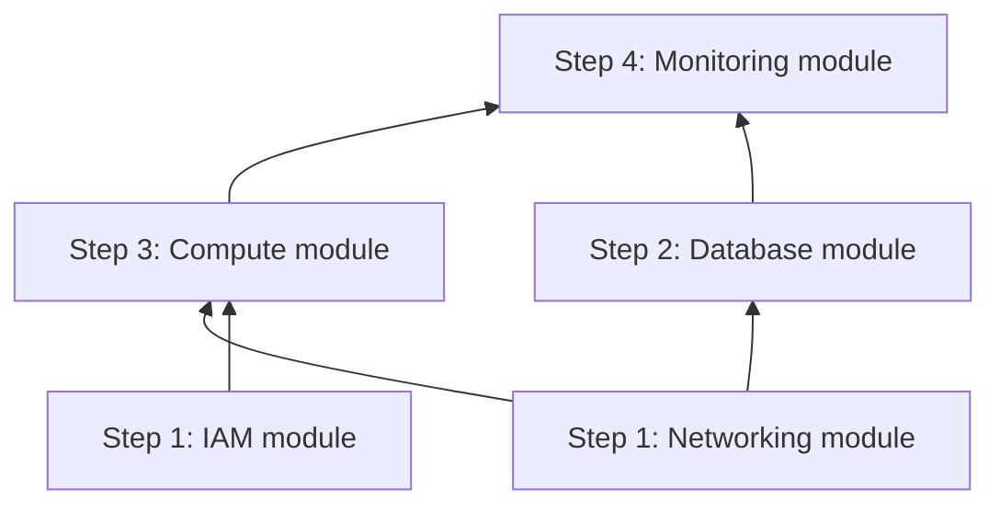

# Terraform Plan: [Service Name] — [Environment]

<!--
Usage: Copy this file to plans/<service>/<env>/terraform-plan.md
This document is the technical implementation plan produced in /plan.
Do NOT write Terraform code until this document is reviewed and approved.
Reference: infrastructure-spec.yaml and architecture.md
-->

> **Status:** Draft | Approved  
> **Spec:** [infrastructure-spec.yaml](../../specs/[service]/[env]/infrastructure-spec.yaml)  
> **Architecture:** [architecture.md](../../specs/[service]/[env]/architecture.md)  
> **Date:** YYYY-MM-DD

---

## ⚠️ Decisions Required Before Build

<!--
List any decisions that are not yet resolved and block code generation.
This must be empty before /build begins.
-->

| # | Decision | Blocks | Owner |
|---|----------|--------|-------|
| — | None — all decisions resolved | — | — |

---

## Overview

[One paragraph: what infrastructure is being built, which service, which environment, what modules will be created.]

---

## Module List

<!--
Which modules will be called from the service root?
Which exist already vs need to be created?
-->

| Module | Path | Status | Purpose |
|--------|------|--------|---------|
| networking | `terraform/modules/networking` | New | VPC, subnets, route tables, NAT |
| iam | `terraform/modules/iam` | New | IAM roles and policies for the service |
| compute | `terraform/modules/compute` | New | ECS / Cloud Run / AKS / Lambda |
| database | `terraform/modules/database` | New | RDS / Cosmos DB / Cloud SQL |
| monitoring | `terraform/modules/monitoring` | New | CloudWatch / Azure Monitor groups and alarms |
| [module] | [path] | [New / Existing / Modified] | [purpose] |

---

## Resource Inventory

<!--
Every Terraform resource that will be created. Used to review scope and estimate cost.
-->

### Networking

| Resource Type | Name Pattern | Count | Notes |
|--------------|-------------|-------|-------|
| VPC / VNet | `${project}-${env}-vpc` | 1 | |
| Public Subnet | `${project}-${env}-public-${az}` | 2 | Multi-AZ |
| Private Subnet | `${project}-${env}-private-${az}` | 2 | Multi-AZ |
| Data Subnet | `${project}-${env}-data-${az}` | 2 | Multi-AZ |
| Internet Gateway | `${project}-${env}-igw` | 1 | |
| NAT Gateway | `${project}-${env}-nat-${az}` | 1–2 | HA = 2 |
| Route Table | `${project}-${env}-public-rt` | 1 | |
| Route Table | `${project}-${env}-private-rt` | 2 | Per-AZ |
| Security Group (ALB) | `${project}-${env}-alb-sg` | 1 | |
| Security Group (App) | `${project}-${env}-app-sg` | 1 | |
| Security Group (DB) | `${project}-${env}-db-sg` | 1 | |

### Compute

| Resource Type | Name Pattern | Count | Notes |
|--------------|-------------|-------|-------|
| [e.g., ECS Cluster] | `${project}-${env}-cluster` | 1 | |
| [e.g., ECS Service] | `${project}-${env}-api-svc` | 1 | |
| [e.g., Task Definition] | `${project}-${env}-api-td` | 1 | |
| Load Balancer | `${project}-${env}-alb` | 1 | |
| Target Group | `${project}-${env}-api-tg` | 1 | |

### Data

| Resource Type | Name Pattern | Count | Notes |
|--------------|-------------|-------|-------|
| [e.g., RDS Instance] | `${project}-${env}-db` | 1 | |
| [e.g., DB Subnet Group] | `${project}-${env}-db-subnet` | 1 | |
| [e.g., Parameter Group] | `${project}-${env}-db-params` | 1 | |

### IAM

| Resource Type | Name Pattern | Count | Notes |
|--------------|-------------|-------|-------|
| IAM Role | `${project}-${env}-app-role` | 1 | App execution role |
| IAM Policy | `${project}-${env}-app-policy` | 1 | Least-privilege |
| [e.g., Instance Profile] | `${project}-${env}-app-profile` | 1 | |

### Monitoring

| Resource Type | Name Pattern | Count | Notes |
|--------------|-------------|-------|-------|
| Log Group | `/aws/ecs/${project}/${env}/app` | 1 | |
| CloudWatch Alarm | `${project}-${env}-high-error-rate` | 1 | |
| CloudWatch Alarm | `${project}-${env}-high-latency` | 1 | |
| CloudWatch Dashboard | `${project}-${env}-dashboard` | 1 | Optional |

---

## Variable Contract

<!--
Every variable the service root will accept.
Helps reviewers understand the interface before seeing the code.
-->

### Required Variables (no default)

| Variable | Type | Description |
|---------|------|-------------|
| `project` | `string` | Project name (e.g., myapp) |
| `environment` | `string` | Environment (dev/staging/prod) |
| `aws_region` | `string` | AWS region to deploy into |
| `owner` | `string` | Team or engineer responsible |
| `cost_center` | `string` | Billing cost center code |
| [variable] | [type] | [description] |

### Optional Variables (with default)

| Variable | Type | Default | Description |
|---------|------|---------|-------------|
| `vpc_cidr` | `string` | `"10.0.0.0/16"` | VPC CIDR block |
| `instance_count` | `number` | `1` | Desired instance count |
| `enable_deletion_protection` | `bool` | `true` | Prevent accidental destruction |
| [variable] | [type] | [default] | [description] |

### Sensitive Variables (injected at runtime)

| Variable | Source |
|---------|--------|
| `db_password` | AWS Secrets Manager data source |
| [variable] | [source] |

---

## Output Contract

<!--
What will this service root export?
Other services or CI/CD may consume these.
-->

| Output | Type | Description |
|--------|------|-------------|
| `vpc_id` | `string` | ID of the created VPC |
| `alb_dns_name` | `string` | DNS name of the load balancer |
| `service_url` | `string` | HTTPS URL of the service |
| `db_endpoint` | `string` (sensitive) | Database connection endpoint |
| [output] | [type] | [description] |

---

## Backend Configuration Design

### Backend Type

```
Backend: S3 (AWS) / Azure RM / GCS
```

### State File Path

```
State key: services/[service]/[env]/terraform.tfstate
```

### Backend Config File

```
backends/[env].tfbackend
```

Contents (example for AWS S3):

```ini
bucket       = "[project]-terraform-state-[account-id]"
key          = "services/[service]/[env]/terraform.tfstate"
region       = "[region]"
encrypt      = true
use_lockfile = true # Native S3 state locking (Terraform v1.10+)
```

---

## Implementation Order

<!--
Dependencies between modules determine build order.
Always build foundations before consumers.
-->



**Build sequence:**

| Step | Task | Depends On | Verification |
|------|------|-----------|-------------|
| 1a | Create `modules/networking` | None | `terraform validate` on module |
| 1b | Create `modules/iam` | None | `terraform validate` on module |
| 2 | Create `modules/database` | networking | `terraform validate` on module |
| 3 | Create `modules/compute` | networking, iam | `terraform validate` on module |
| 4 | Create `modules/monitoring` | compute, database | `terraform validate` on module |
| 5 | Create service root `[service]/[env]` | All modules | Full `terraform plan` |

---

## Risks and Mitigations

| Risk | Likelihood | Impact | Mitigation |
|------|-----------|--------|------------|
| State backend not yet provisioned | Medium | High | Bootstrap state bucket before running service Terraform |
| IAM permissions insufficient for CI/CD | Medium | High | Test with `--dry-run` in lower environment first |
| Cost overrun from NAT gateway | Low | Medium | Use single NAT in dev; multi-AZ only in prod |
| [Risk] | [Low/Med/High] | [Low/Med/High] | [mitigation] |

---

## Verification Plan

### After Each Module

```bash
# Validate module
cd terraform/modules/<module>
terraform init -backend=false
terraform validate
tflint
```

### After Service Root Assembly

```bash
# Full validation
cd terraform/services/[service]/[env]
terraform init -backend-config=../../../backends/[env].tfbackend
terraform fmt -check -recursive
terraform validate
tflint

# Plan (requires cloud credentials)
terraform plan -var-file=terraform.tfvars -out=tfplan
```

### Checklist Before /build Completion

- [ ] All modules listed above are created
- [ ] `terraform fmt -check` passes across all files
- [ ] `terraform validate` passes in all module directories
- [ ] `terraform validate` passes in the service root
- [ ] No hardcoded values in any `.tf` file
- [ ] All variables have `type` and `description`
- [ ] All outputs have `description`

---

## Open Items

<!--
Anything that needs resolution before or during /build.
Clear this list before closing /build.
-->

- [ ] [Open item 1]
- [ ] [Open item 2]
